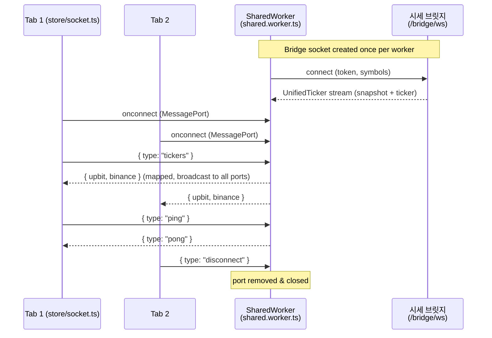
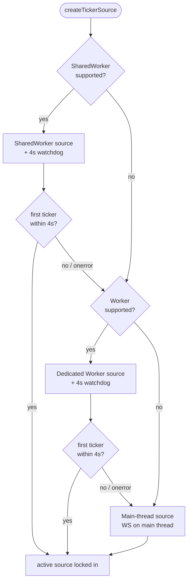
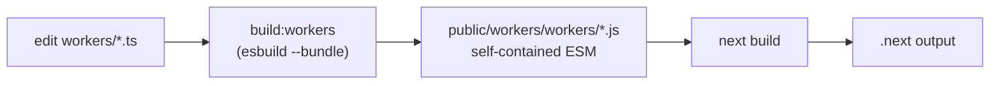

# Architecture & Conventions — Coinat v2

## Real-time data flow (SharedWorker)

One SharedWorker holds a single **bridge WebSocket** — to the unified 시세 브릿지 (`/bridge/ws`), which aggregates the Upbit + Binance feeds server-side — shared across all browser tabs. Each tab connects via a `MessagePort` and polls with a `tickers` message; the worker maps the bridge's `UnifiedTicker` stream into the legacy `{ upbit, binance }` payload (`@/lib/ws/bridgeMapper`) and broadcasts it to every connected port.

## Real-time fallback for browsers without SharedWorker

`SharedWorker` is unavailable on Safari, most mobile browsers, and Android Chrome. `SharedWorkerProvider` therefore selects a source **progressively — SharedWorker → Dedicated Worker → main thread** — via `apps/web/src/lib/ticker-source/createTickerSource.ts`. All tiers expose the same `TickerSource` interface and emit the same payload, so the provider and store don't care which is active. Each worker tier is guarded by capability detection plus a ~4s watchdog: a missing API, a thrown constructor, or a worker script that fails to load degrades to the next tier. The main-thread tier always works, so unsupported browsers keep live data instead of crashing the error boundary.

Details: `apps/web/src/lib/ticker-source/README.md`.

## Build pipeline (apps/web)

## Conventions
- **Monorepo**: Turbo for task orchestration; shared configs live in `packages/@repo/*`.
- **API layer (web)**: `apps/web/src/api/index.ts` centralizes external/internal API calls (Axios).
- **Data fetching**: prefer custom React Query hooks in `apps/web/src/hooks/queries/` for consistency and cache reuse.
- **Real-time**: use the SharedWorker (`apps/web/workers/shared.worker.ts`) for ticker streams — do **not** open redundant WebSocket connections in the main thread. All tiers connect to the unified 시세 브릿지 via a single `BridgeWebSocket` (`@/lib/ws/bridgeWS.ts`). The bulk of socket/store logic lives in `apps/web/src/store/socket.ts` (large); `apps/web/src/store/coin.ts` is the small coin store.
- **Error handling**: `react-error-boundary` + shared `ErrorMessage` components.
- **Styling**: Tailwind for layout/utilities; Emotion for complex/dynamic styling.
- **TypeScript**: strict typing across the codebase.
- **Formatting**: follow the Prettier/ESLint/Stylelint configs; run `pnpm lint` (and `lint:css` in web) to verify.

## Build Quirks
- **Workers must bundle before the Next build.** `build:workers` runs **esbuild** (`--bundle --format=esm`) over `workers/*.worker.ts` → self-contained `public/workers/workers/*.js`. tsc was insufficient: it leaves `@/` path aliases the browser can't resolve in a module worker. Rebuild (or `watch:workers`) after editing `apps/web/workers/`.
- **Load workers by string path**, e.g. `new SharedWorker('/workers/workers/shared.worker.js', { type: 'module' })` — files in `public/` serve at `/` (no `/public` prefix). Avoid `new URL(path, import.meta.url)`: webpack inlines `import.meta.url` as a `file://` path, so the worker resolves to `file:///workers/...` and silently fails → every tier downgrades to main-thread.
- **Hybrid routing in web**: `apps/web/src/app/` (App Router) and a legacy `apps/web/src/pages/` (Pages Router) coexist.
- **api dev uses Turbopack** (`next dev --turbopack`).
- **Env files** are per-app: `apps/web/.env.development`, `apps/api/.env.development` (Supabase URL + keys; see `apps/api/.env.example`). There is no root env file.
- **Version split**: web on Next.js 14.2.x, api on Next.js 15.3.x — intentional; separate apps with no shared build output.
