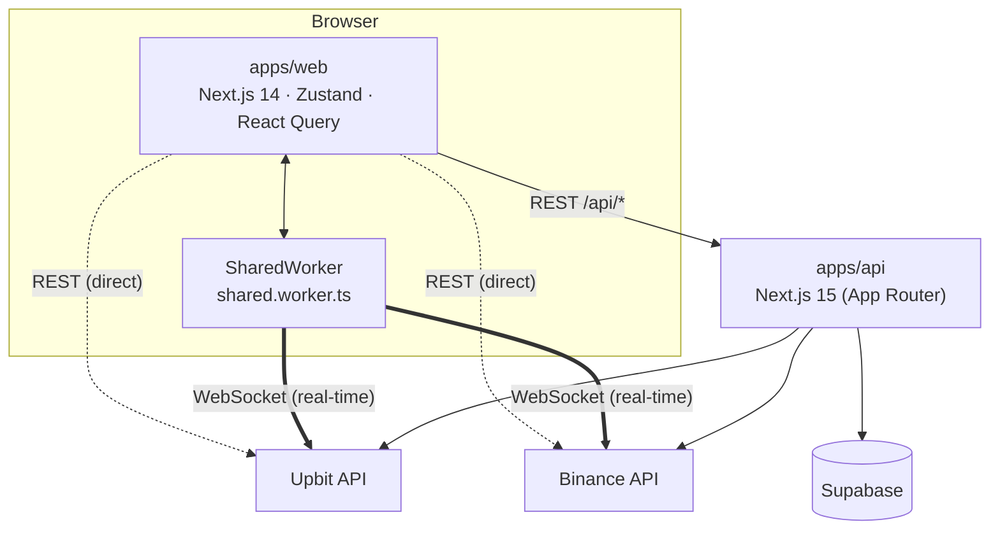
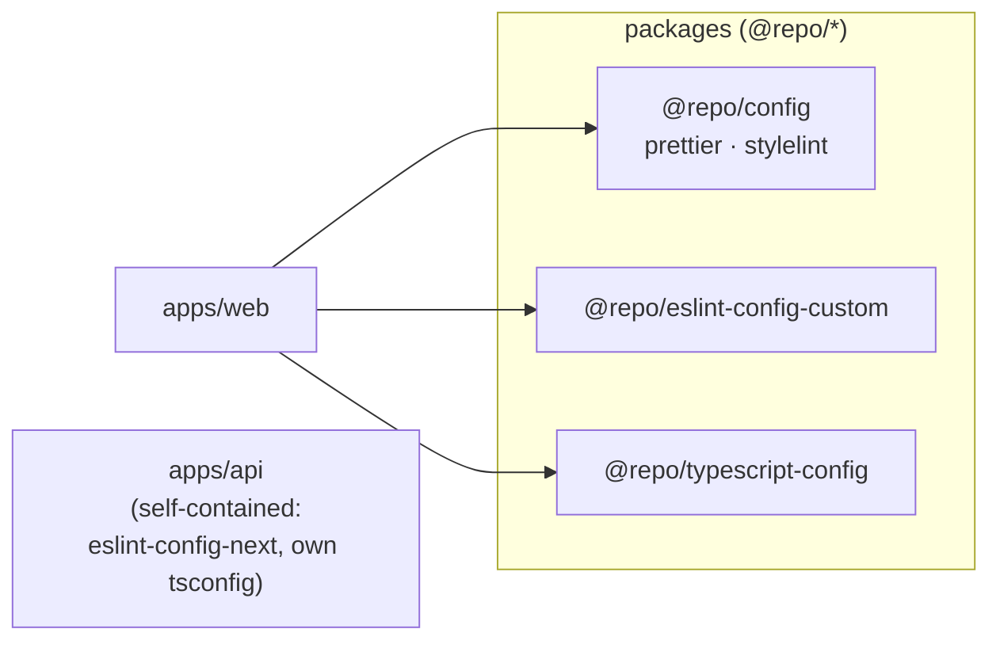

# Project Structure — Coinat v2

Monorepo orchestrated by **Turbo** over **pnpm workspaces**.

## System context

Real-time tickers stream **directly** from the browser's SharedWorker to the exchange WebSockets. REST data (candles, news, market, coin-info) is proxied through `apps/api`; some calls also hit the exchanges' REST APIs directly.

## Workspace dependency graph

Only `apps/web` consumes the shared `@repo/*` packages. `apps/api` is self-contained (its own `eslint.config.js` via `eslint-config-next`, and a standalone `tsconfig.json` with no `extends`).

## Apps & Packages
- **`apps/web`** — Frontend. **Next.js 14** (14.2.x), React 18, TypeScript.
  - **State**: Zustand (global UI/coin state).
  - **Server state**: React Query / TanStack Query.
  - **Real-time**: SharedWorker (`apps/web/workers/shared.worker.ts`) sharing WebSocket connections (Upbit, Binance) across tabs.
  - **Charts**: Lightweight Charts (TradingView).
  - **Styling**: Tailwind CSS + Emotion; UI built on `ownui-system`.
- **`apps/api`** — Backend. **Next.js 15** (15.3.x) App Router. Proxies/aggregates external crypto data (Upbit, Binance) and integrates Supabase (`@supabase/supabase-js`).
- **`packages/`** — Shared workspace configs:
  - `@repo/config` — Prettier & Stylelint presets.
  - `@repo/eslint-config-custom` — shared ESLint config.
  - `@repo/typescript-config` — shared tsconfig bases.

## Key Files & Directories
| Path | Purpose |
|------|---------|
| `apps/web/src/app/` | Next.js App Router (frontend) |
| `apps/web/src/pages/` | Legacy Pages Router (still present) |
| `apps/web/src/api/index.ts` | Centralized API clients (Axios) |
| `apps/web/src/hooks/queries/` | React Query hooks |
| `apps/web/src/store/` | Zustand stores (`coin.ts`, `socket.ts`) |
| `apps/web/workers/shared.worker.ts` | SharedWorker for real-time data |
| `apps/api/app/api/` | Backend route handlers (`upbit/*`, `binance/market`, `coin-info`) |
| `packages/{config,eslint-config-custom,typescript-config}/` | Shared `@repo/*` configs |
| `turbo.json` | Turbo task pipeline |
