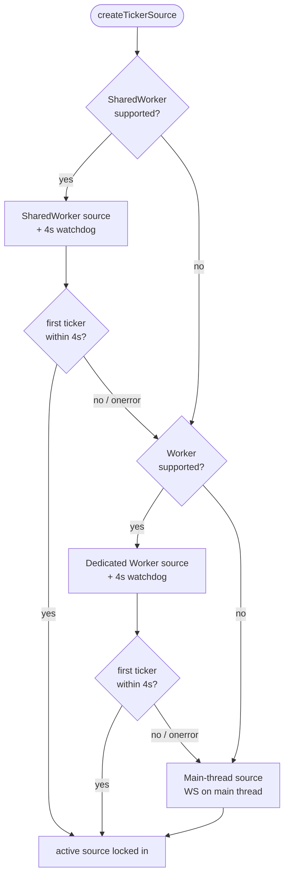
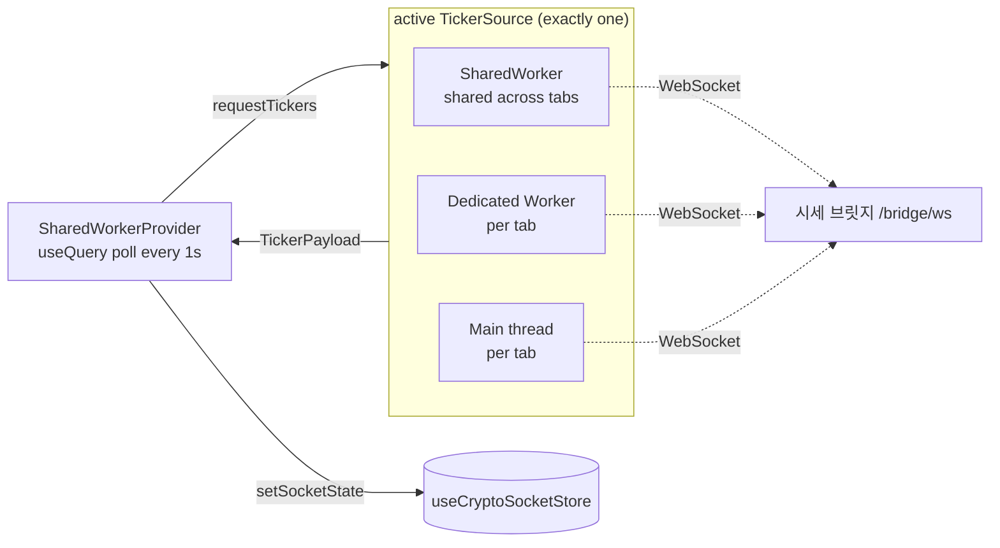

# Ticker Source — progressive real-time fallback

Real-time tickers are delivered through a **progressive fallback chain** so they keep working on browsers that don't support `SharedWorker` (Safari, most mobile browsers, Android Chrome). Without this, `new SharedWorker(...)` throws and — because the provider sits inside `RootErrorBoundary` — crashes the whole app.

All three tiers expose the same `TickerSource` interface (`requestTickers()` / `disconnect()`) and emit the same `TickerPayload`, so `SharedWorkerProvider` is agnostic to which one is active.

## Tier selection (`createTickerSource`)

Each worker tier is guarded by capability detection, a `try/catch` around construction, error handlers, and a **4s watchdog**. A missing API, a thrown constructor, or a worker script that fails to load all degrade to the next tier. The main-thread tier always succeeds.

Once a tier delivers its first payload it is "settled" and later errors no longer trigger a downgrade — the WS clients self-reconnect within that tier.

## Data flow (whichever tier is active)

## Zombie port cleanup (SharedWorker tier)

The `SharedWorker` keeps one `MessagePort` per connected tab in a `ports[]` list and broadcasts each payload to all of them. A tab that closes *gracefully* sends a `Disconnect` message and is removed immediately. But a tab that vanishes **without** one — a crash, a force-kill, or a browser that never fires `unload` — leaves a **zombie port** behind.

These zombies are not caught reactively: posting to a dead `MessagePort` is a silent no-op, not a throw, so the broadcast `try/catch` never fires for them. Instead they are reaped on a timer:

- Each port is wrapped in `BrowserPort`, which holds the `MessagePort` in a `WeakRef`. Once the owning tab is gone and the port is collected, `deref()` returns `undefined` and `isAlive()` becomes `false`.
- `reapDeadPorts(ports)` (`@/lib/ws/reapDeadPorts`) closes and drops those ports. The worker runs it on a 10s `setInterval`, started on the first connection and stopped once the list empties (so the worker isn't pinned alive after the last tab leaves).

**Caveat — cleanup timing is non-deterministic.** A zombie is only removed *after* GC has actually collected its `MessagePort`, and GC timing is up to V8 (no memory pressure → it may run much later). So a vanished tab can linger in `ports[]` until the next collection; shortening the sweep interval doesn't help because there is nothing to reap until GC runs. If a bounded cleanup latency is ever required, extend `reapDeadPorts` with a per-port `lastSeen` heartbeat timeout (each inbound message refreshes it; the 1s `requestTickers` poll keeps live tabs fresh) and reap on `idle > N` in addition to the `deref()` check.

## Files

| File | Role |
|------|------|
| `createTickerSource.ts` | Progressive factory: capability detection + watchdog downgrade |
| `sharedWorkerSource.ts` | Tier 1 — `SharedWorker`, one WS shared across tabs |
| `dedicatedWorkerSource.ts` | Tier 2 — per-tab `Worker`, off the main thread |
| `mainThreadSource.ts` | Tier 3 — single `BridgeWebSocket` on the main thread |
| `bridgeConfig.ts` | `getBridgeConfig()` — reads `NEXT_PUBLIC_BRIDGE_*` env, shared by all three tiers |
| `types.ts` | `TickerSource`, `TickerPayload`, listener/error types |
| `@/lib/ws/bridgeWS.ts` | `BridgeWebSocket` — one socket to the bridge, exposes `getPayload()` |
| `@/lib/ws/bridgeMapper.ts` | Pure `UnifiedTicker` → `TickerPayload` mapping |
| `@/lib/ws/bridgeWorkerCore.ts` | `BridgeWorkerCore` — shared bridge lazy-init + payload logic for both workers |
| `@/lib/ws/worker-messages.ts` | `WorkerMsg` — message protocol constants (SSOT) shared by workers and sources |
| `@/lib/ws/reapDeadPorts.ts` | Drops `SharedWorker` ports whose `MessagePort` has been GC'd (zombie cleanup) |
| `@/lib/browser-port.ts` | `BrowserPort` — `WeakRef`-wrapped `MessagePort` exposing `isAlive()` |

The worker tiers load the compiled workers from `apps/web/workers/` (`shared.worker.ts`, `dedicated.worker.ts`); all three tiers build a single `BridgeWebSocket` (`@/lib/ws/bridgeWS`) that connects to the unified 시세 브릿지 and maps `UnifiedTicker` → `TickerPayload` via `@/lib/ws/bridgeMapper`. Both workers share `BridgeWorkerCore` so their bridge lifecycle cannot drift apart. Bridge config (`wsBase`/`token`) is read from `NEXT_PUBLIC_*` env in the Next bundle via `getBridgeConfig()` (`bridgeConfig.ts`) — env is unavailable inside the tsc worker build, so the main-thread sources read it and pass it to the workers via an `init` message. Message types use the `WorkerMsg` constants (`@/lib/ws/worker-messages`) on both sides.
