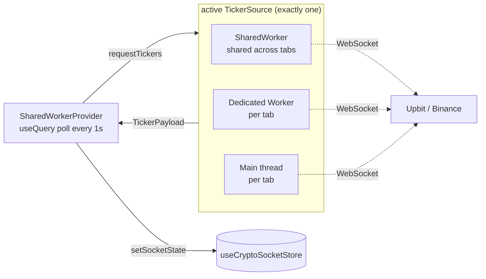

# Ticker Source — progressive real-time fallback

Real-time tickers are delivered through a **progressive fallback chain** so they keep working on browsers that don't support `SharedWorker` (Safari, most mobile browsers, Android Chrome). Without this, `new SharedWorker(...)` throws and — because the provider sits inside `RootErrorBoundary` — crashes the whole app.

All three tiers expose the same `TickerSource` interface (`requestTickers()` / `disconnect()`) and emit the same `TickerPayload`, so `SharedWorkerProvider` is agnostic to which one is active.

## Tier selection (`createTickerSource`)

Each worker tier is guarded by capability detection, a `try/catch` around construction, error handlers, and a **4s watchdog**. A missing API, a thrown constructor, or a worker script that fails to load all degrade to the next tier. The main-thread tier always succeeds.

Once a tier delivers its first payload it is "settled" and later errors no longer trigger a downgrade — the WS clients self-reconnect within that tier.

## Data flow (whichever tier is active)

## Files

| File | Role |
|------|------|
| `createTickerSource.ts` | Progressive factory: capability detection + watchdog downgrade |
| `sharedWorkerSource.ts` | Tier 1 — `SharedWorker`, one WS shared across tabs |
| `dedicatedWorkerSource.ts` | Tier 2 — per-tab `Worker`, off the main thread |
| `mainThreadSource.ts` | Tier 3 — `UpbitWebSocket`/`BinanceWebSocket` on the main thread |
| `types.ts` | `TickerSource`, `TickerPayload`, listener/error types |

The worker tiers load the compiled workers from `apps/web/workers/` (`shared.worker.ts`, `dedicated.worker.ts`); the WebSocket clients (`@/lib/ws/*`) are reused unchanged across all three tiers.
